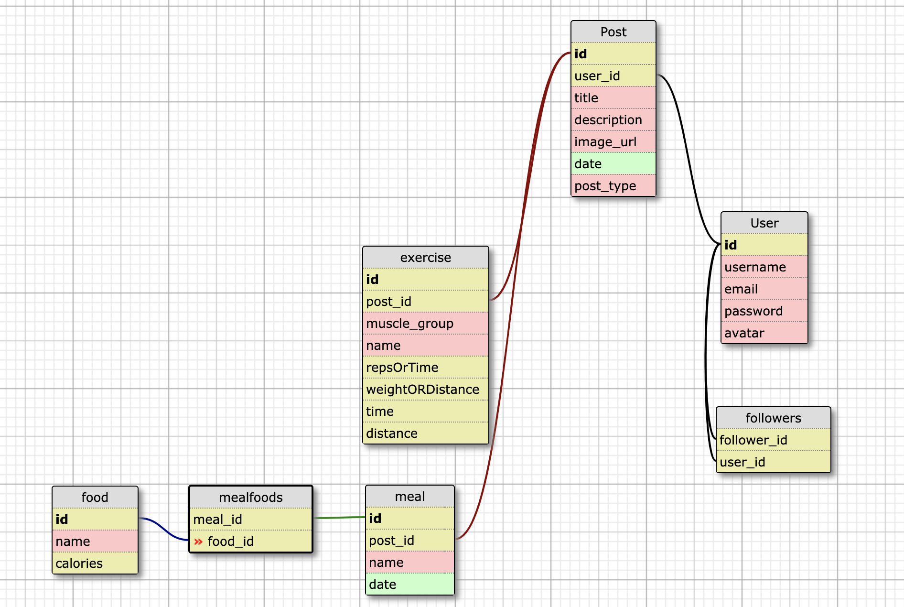

## Functionality

## Contributing  

### Prerequisites/ Dependencies
 This project assumes you have installed:

### Installing

1. Clone down the repo:

2. Run:

3. Setup the database:

## API Documentation
View all routes, requests, responses, and errors [here](./api_doc.md)

## MVP Schema 
 

## Next Steps/Known Issues

## View Front End Implementation

### Contributors
[Tim Fell](https://github.com/TimothyFell)

[Nikki Holland-Plum](https://github.com/mnhollandplum)
